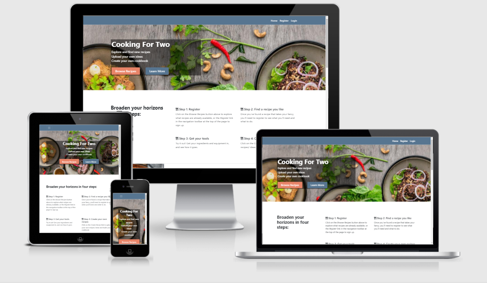

# Cooking For Two

Cooking is a hobby and necessity that can be challenging to fit into a busy lifestyle.  This website will aim to help give new ideas to two-person households (or could be doubled-up for a four-person household) and serve as a repository – essentially a personalised online cooking book – that users can upload new recipes to, modify or delete these new recipes, and buy the necessary kitchen equipment needed to cook the recipes.

The live website can be viewed [here](https://cooking-for-two.herokuapp.com/).

## Contents:
[UX](#ux) 
[Structure](#structure) 
[Database Design](#database-design) 
[Technologies Used](#technologies-used) 
[Testing](#testing) 
[Deployment](#deployment) 
[Credits](#credits)

-----

## UX
User Stories

As a user of the site, I want:
- to be able to easily view a range of dishes and their recipes.
- to clearly understand the layout of the website and move about easily.
- to be able to view the website on any device for convenience (e.g. on the user's phone while cooking)
- to be able to create my own recipes on the website and store them there.

As an administrator of the site, I want:
- to be able to update or delete any recipe on the site, to allow quality control.

As a business owner of the site, I want:
- users to sign up to the website to encourage them to use it more often.
- users who are registered and signed in to easily create recipes and use the site, thus encouraging repeat visits.
- users to be encouraged, but not pushed, to visit the shop page to buy items through the website.

## Structure
### Overview of site and page structure, including functionality and purpose:

Home Page

- Header for easy navigation between pages of the site.
- Flashed messages appear to left of navigation bar for consistency throughout site.
- Welcome title with 'Browse Recipes' and 'Register' buttons for simplicity and clarity
- Dish Cards for key information about a dish - region, title, creator, 'More' button to register

 

Register Page/ Login Page

- Username input: text input box
- Password input: text input box
- Submit Button: to send information to back-end
- Sign-in link: if users already have a profile

 

Profile Page

- Similar structure to Home Page to ensure consistency across website to improve UX
- Welcome message now has "User's Homepage" to indicate logged in
- Search bar to allow user to filter for recipes/ dishes/ ingredients they would want
- 'More' button on individual dish cards leads to Recipe page

 

Recipe Page

- Image of dish
- 'Edit' and 'Delete' for creator of recipe, or admin
- Ingredients, recipe and equipment information

 

Create / Edit Recipe Page

- Region dropdown field
- Dish Name field (text)
- Ingredients field (text)
- Equipment field (text)
- Description field (Text)
- URL field for image (URL)
- All fields prepopulate if on Edit Recipe page

 

### Wireframes for skeleton of website
[Home Page (top)](static/wireframes/edit_recipe_page.png)

[Home Page (scrolled down)](static/wireframes/home_page_scrolled_down.png)

[Log In Page](static/wireframes/log_in_page.png)

[Sign Up Page](static/wireframes/sign_up_page.png)

[Recipe Page](static/wireframes/recipe_page.png)

[Edit Recipe Page](static/wireframes/edit_recipe_page.png)

[Upload Recipe Page](static/wireframes/upload_recipe_page.png)

[Shop Page](static/wireframes/shop_page.png)

### Surface 
#### Colour and Styling 
I originally planned to use [this logo](static/images/logo.png) but eventually decided that the photo-image used on the final website fitted better and looked more professional.  However, the colour theme from this logo was used for the theme of the website, with this [colour palette](static/images/colour_scheme.png) being used with the following colours to give an earthy-theme to the site:
- #E88468 - pastel red
- #577590 - pastel blue
- #9FB37F - pastel green
- #EAC576 - pastel yellow
- #583B23 - dark brown
- black and white where necessary for maximum contrast

#### Language & tone

#### Styling considerations

-----

## Database design
(dbdiagram.io)
    Indexes
        recipes
    Queries
        browsing
        users
        searching
        uploading
        deletion

-----

## Technologies used

Languages

- HTML5 (for content/ structure)
- CSS3 (for styling)
- JavaScript (for interactive elements, e.g. buttons)
- Python (for core site functionality including user login and accessing database information)
- Jinja (for generating HTML from site templates)

 

Libraries

    
- Bootstrap
- Font Awesome
- jQuery (for Bootstrap)
- Flask
- Werkzeug

 

Editors

- GitHub - code repository with version control management
- GitPod - IDE for writing and editing code
- dbDiagram - for planning DB structure
- Balsamiq - wireframes for visual planning of website structure

 

Tools

- TinyPNG/ TinyJPG - to reduce size of images & wireframes
- Coolers - colour palette generation to find appropriate colour scheme for site
- Am I Responsive? - for screenshots of site for Readme

 

Database Management

- MongoDB - for storing user profile and recipe information

 

Deployment Platform

- Heroku - for hosting website

 

-----

## Testing

### Automatic Testing

User Stories Testing
As a user of the site, I want:
- to be able to easily view a range of dishes and their recipes.
    Included all dishes available on home page, to allow instant access to see what range is available.
- to clearly understand the layout of the website and move about easily.
    Included navbar and instructions for website to allow ease of use, and also ensured that Creating, Reading, Updating and Deleting recipes are within 2 pages of user's profile page to allow convenience.
- to be able to view the website on any device for convenience (e.g. on the user's phone while cooking)
    Ensured that the website was fully responsive and would work on all common devices through Chrome's Dev Tools.
- to be able to create my own recipes on the website and store them there.
    Included Create functionality once user logged in to allow creation of custom recipe.

As an administrator of the site, I want:
- to be able to update or delete any recipe on the site, to allow quality control.
    Included admin rights to allow updating or deleting rights to admin user.

As a business owner of the site, I want:
- users to sign up to the website to encourage them to use it more often.
    Ensured that only registered and signed-in users can access the actual recipes and ingredients of dishes.
- users who are registered and signed in to easily create recipes and use the site, thus encouraging repeat visits.
    Included navbar and instructions for website to allow ease of use, and also ensured that Creating, Reading, Updating and Deleting recipes are within 2 pages of user's profile page to allow convenience.
- users to be encouraged, but not pushed, to visit the shop page to buy items through the website.
    Included 'Shop' page which 'Recipe' page has links to, so users can easily be taken within 2 clicks to a shopping site to purchase their necessary equipment for the recipe.

-----

## Deployment

### Application Hosting

The site is hosted using Heroku, deployed from the master branch of GitHub, and updates automatically as new commits are pushed.  

To create a Heroku app:
- From heroku.com, sign in to your account (or create a new one if needed).
- Select 'new' and '[create new app](static/deployment/No1.PNG)'
- Select '[deploy to GitHub](static/deployment/No2.PNG)' and select your repository and project name.  Select `connect`.

### Environmental variables:
- In the terminal window of your IDE, type in:

    `pip3 freeze --local > requirements.txt` (this creates a file with the required modules for Heroku)
    `python3 app.py > Procfile` (this creates a file that tells Heroku how to launch the app)
    touch .gitignore (creates file including the files/ directories to be excluded from live development)

- Ensure that your `env.py` file is listed in this .gitignore file.
- `env.py` should include the following:

        import os
        os.environ.setdefault("IP", "0.0.0.0")
        os.environ.setdefault("PORT", "5000")
        os.environ.setdefault("SECRET_KEY", "")
        os.environ.setdefault("MONGO_URI", "")
        os.environ.setdefault("MONGO_DBNAME", "")
- For the final 3 variables, these should be unique identifiers to your project, which will be aligned with the Heroku variables (see below).

- Back on the Heroku dashboard, select `settings` and '[config vars](static/deployment/No3.PNG)'
- Fill in these [environment variables](static/deployment/No4.PNG) from your `env.py` file

### MongoDB

- Sign in or register with MongoDB at mongodb.com.
- Create a cluster, then a database.
- Within this database, create as many collections needed - these would be groups of information, e.g. `users` for one collection, `dishes` for another, `categories` for another.
- Within each collection, add values required.  These can be various types of information, e.g. strings/ arrays, dictionaries.

-----

## Credits

### Design and Research

- [Code Institute](https://codeinstitute.net/) - particularly the Backend Development Mini Project
- [Wanderlust Recipes](https://wanderlust-recipes.herokuapp.com/recipes) - MS3 Project by Russell Oakham, used for reference and inspiration

### Content

- [Hello Fresh](https://www.hellofresh.co.uk/) - for recipe ideas and images
- fontawesome.com for icons
- All other content written by myself

### Structure

- startbootstrap.com for modified structure of [home page](https://startbootstrap.com/previews/modern-business) and [individual recipe page](https://startbootstrap.com/previews/small-business)
- bootsnip.com for structure/ idea of [forms with background image](https://bootsnipp.com/snippets/vl4R7)
- https://codingyaar.com/bootstrap-4-card-image-left-responsive/ - for effective structure of formatting cards for recipes
- Article on [Adding dropdowns in README.md](https://dev.to/asyraf/how-to-add-dropdown-in-markdown-o78)

