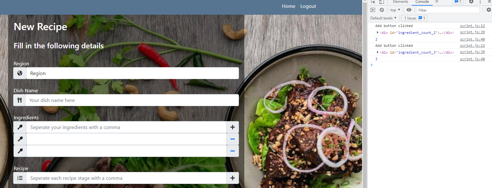

# Cooking for Two Testing

## Manual Testing
### All the following have been confirmed as working and correct:
-   All navigation links work correctly across all pages, and that mobile navbar (burger bar) works correctly.
-   User able to register and taken to profile page, and that DB saves information.
-   Registered user is able to log in and out.
-   Logged-in user is able to upload a new recipe, and this saves to DB.
-   User able to edit pre-existing recipe that they have created.  Unable to edit pre-existing recipe created by other user.
-   User able to delete a recipe they have created; modal offers confirmation step so as not to accidentally delete recipe.
-   User able to search for recipes based on key word, ingredient or title; no results show 'No Recipes Found' as expected.
-   Admin able to edit any recipe, regardless if they have created it or not.
-   Admin able to delete any recipe, regardless if they have created it or not; modal offering confirmatory step working correctly.
-   Admin able to view, create new, amend or delete any category (i.e. region) of dish.

## Validation
### HTML
-   The [W3 Validator](https://validator.w3.org/) was used to check that there were no errors in the HTML code.
-   Errors that were found were due to the Jinja templating language.

### CSS
-   The [W3 Validator](https://validator.w3.org/) was used to check that there were no errors in the CSS code.
-   There were no errors found.

### JavaScript
-   The only JavaScript used in the final product of the website was Bootstrap's inbuilt JS.
-   Please see below: 'Adding Ingredients' in [Issues still to overcome](#issues-still-to-overcome)

### Python
-   The [PEP8 Validator](http://pep8online.com/) was used to check that there were no errors in the Python code.
-   There were no errors found.

### Google Lighthouse Audit

## Testing User Stories

### As a user of the site, I want:
- to be able to easily view a range of dishes and their recipes.
    - Included all dishes available on home page, to allow instant access to see what range is available.
- to clearly understand the layout of the website and move about easily.
    -   Included navbar and instructions for website to allow ease of use, and also ensured that Creating, Reading, Updating and Deleting recipes are within 2 pages of user's profile page to allow convenience.
- to be able to view the website on any device for convenience (e.g. on the user's phone while cooking)
    -   Ensured that the website was fully responsive and would work on all common devices through Chrome's Dev Tools.
- to be able to create my own recipes on the website and store them there.
    -   Included Create functionality once user logged in to allow creation of custom recipe.

### As an administrator of the site, I want:
- to be able to update or delete any recipe on the site, to allow quality control.
    -   Included admin rights to allow updating or deleting rights to admin user.
    -   Allowed admin ability to create, edit, and delete any region ('category') for recipes.

### As a business owner of the site, I want:
- users to sign up to the website to encourage them to use it more often.
    -   Ensured that only registered and signed-in users can access the actual recipes and ingredients of dishes.
- users who are registered and signed in to easily create recipes and use the site, thus encouraging repeat visits.
    -   Included navbar and instructions for website to allow ease of use, and also ensured that Creating, Reading, Updating and Deleting recipes are within 2 pages of user's profile page to allow convenience.
- users to be encouraged, but not pushed, to visit the shop page to buy items through the website.
    -   Did not include shop page due to time constraints with project, but would include as future development (i.e. non-MVP) to allow company owning website to generate income stream from this feature.

## Issues overcome during development

### Delete Functionality
- Delete functionality worked as it should before adding modal for user to confirm, both for dishes and category.  However, once modal was added, this lost the ID of the dish/ category it was meant to delete, so regardless of the dish or category chosen for deletion, it deleted the first one (i.e. the top one of the list) in the database.
    -   Changed delete option to within the 'edit' page for both the dish and category.  This meant that the modal then held onto the ID of the item in question, and would delete it correctly and as expected.  I do not feel that by shifting this delete functionality to within the individual page of the dish or category the UX has suffered, so feel this is an acceptable work-around.

## Issues still to overcome

### Multiple inputs for ingredient items and recipe stages
- In script.js, was able to successfully add a new input when a user clicked on a '+' button next to the ingredient input in add_recipe.html:

Adding Ingredients

JS code

        
        // Empty div to store template literal in for new input
        let addIngredientDiv = document.getElementById("add-ingredient-div");

        // '+' Button on input field for ingredient
        let add_ingredient = document.getElementById("add-ingredient")

        // counter starts at two as user will be adding second ingredient
        let ingredient_count = 2;

        // function if '+' button is pressed
        function addIngredient(){
            console.log("Add button clicked")
            let newIngredient = `
                

                

                    <i class="fas fa-utensil-spoon"></i>
                

                
                <input id="ingredients" name="ingredients" type="text" class="form-control validate" minlength="5"
                    placeholder="" required>
                
                

                    <a class="minus-ingredient" onclick="minusIngredientFunction"><i class="fas fa-minus"></i></a>
                

                
                

            `
            let extraItem = document.createElement("div")

            // Adds above template literal into new empty div
            extraItem.innerHTML += newIngredient
            addIngredientDiv.appendChild(extraItem)

            // Sets id of new input as the ingredient number (i.e. 3rd ingredient is ingredient_count_3)
            extraItem.setAttribute("id", `ingredient_count_${ingredient_count}`)

            // for test purposes
            console.log(extraItem)
            console.log(ingredient_count)

            // After each ingredient added, counter increases ready for next ingredient
            ingredient_count ++;

        }

        // For other HTML pages on site, nothing happens if can't find add_ingredient (the '+' sign)
        if (add_ingredient != null) {
            add_ingredient.addEventListener("click", addIngredient);
        }

-   However, due to time constraints was unable to find a way for the 'remove' functionality to remove an input once the user had added it.  (There were several methods I tried, one of which was passing an [onclick event in a template literal](https://stackoverflow.com/questions/45129421/passing-onclick-event-in-template-literal), but unfortunately this did not work.)
-   The workaround I have implemented is the user inputting ingredients and recipe stages as a string separated by a comma, then the Python split(', ') method is splitting these into separate strings into an array for storage in the database.
-   In this way, the user has input functionality for the creation and amending of recipes, so basic CRUD functionality is achieved, and for future release (using the Agile framework's iterative development methodology) this ability to add and remove ingredients and recipe stages on the front-end HTML page can be a non-MVP feature.

